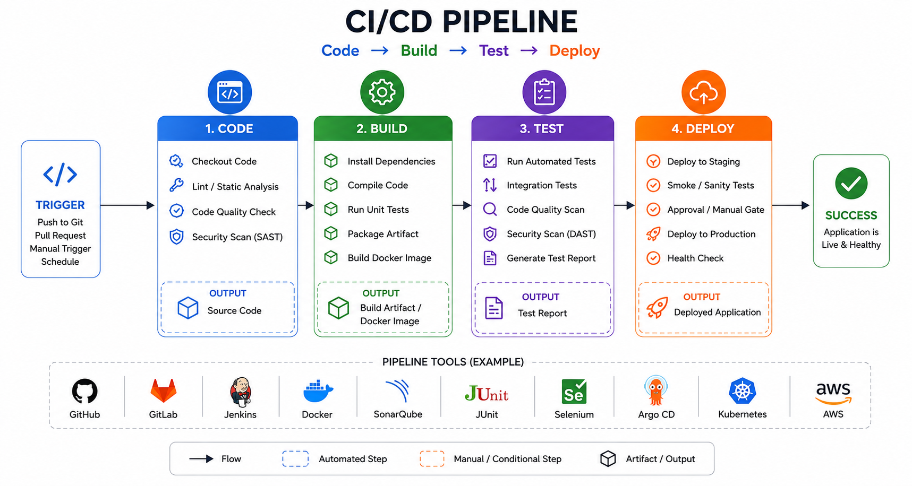

# CI/CD Automation & Deployment Optimization: A Case Study in Production-Grade Delivery

## 📌 Overview
This project is a comprehensive implementation of a production-grade Continuous Integration and Continuous Deployment (CI/CD) system. Rather than just a set of scripts, this repository serves as a blueprint for achieving **high deployment velocity** without sacrificing **stability or security**.

The primary objective was to eliminate manual intervention in the release process, replacing it with an auditable, repeatable, and automated pipeline that supports complex deployment strategies like Blue-Green and Canary releases.

---

## 🚀 The Engineering Challenge
In many traditional environments, deployments are the "scariest" part of the cycle—prone to human error, lack of visibility, and slow recovery times during failures.

**The goal was to solve three critical problems:**
1. **Deployment Anxiety:** Reducing the risk of downtime during updates.
2. **Consistency Gap:** Ensuring that what is tested in CI is exactly what runs in Production.
3. **Recovery Latency:** Minimizing the Mean Time to Recovery (MTTR) when a bad release occurs.

---

## 🛠️ The Solution: Architecture & Strategy

### 🏗️ High-Level Architecture
The system implements a linear progression from code commit to production traffic, with integrated quality gates at every stage.



### 🎯 Key Engineering Decisions

#### 1. Deployment Strategies (Zero-Downtime)
To solve the "Deployment Anxiety" problem, I implemented three distinct strategies:
*   **Blue-Green:** Parallel environments allow for instant switching and near-zero rollback time.
*   **Canary:** Incremental traffic shifting allows us to test "in the wild" with a small subset of users before full promotion.
*   **Rolling Updates:** Ensures constant availability by updating pods one-by-one.

#### 2. The "Shift-Left" Security Approach
Security is not a final step but is integrated into the pipeline:
*   **Static Analysis:** Linting and security audits run on every PR.
*   **Image Scanning:** Every container build is scanned by **Trivy** for CVEs before being pushed to the registry.
*   **Runtime Hardening:** Containers are configured with non-root users and read-only filesystems.

#### 3. Automated Health-Based Rollbacks
The pipeline doesn't just "deploy and forget." It monitors liveness and readiness probes. If the smoke tests fail post-deployment, the system triggers an **automatic rollback** to the previous stable version, ensuring the service remains available.

---

## 📂 Repository Structure

| Path | Engineering Purpose |
| :--- | :--- |
| `src/` | Core application logic (Node.js/Express). |
| `tests/` | Pyramidal testing strategy: Unit $\rightarrow$ Integration $\rightarrow$ Smoke. |
| `docker/` | Multi-stage builds to minimize image size and attack surface. |
| `k8s/` | Declarative infrastructure for scaling and self-healing. |
| `scripts/` | The "Engine" — contains logic for Blue-Green/Canary orchestration. |
| `.github/workflows/` | The "Orchestrator" — defines the automated lifecycle. |
| `docs/` | The "Brain" — contains ADRs and Operational Runbooks. |

---

## 🚦 Quick Start & Local Validation

### Prerequisites
- Node.js 18+ | Docker | Bash

### Local Execution
```bash
# Install and start
npm install && npm start

# Validate the pipeline locally
npm run lint
npm test -- --coverage
docker build -f docker/Dockerfile --target production .
```

### Testing Deployment Strategies
To simulate a Blue-Green deployment locally:
```bash
docker compose -f docker/docker-compose.yml --profile blue-green up -d
bash scripts/deploy/smoke-test.sh --url http://localhost:3000
```

---

## 📈 Outcomes & Impact
*   **Deployment Frequency:** Increased from manual weekly releases to on-demand, automated deployments.
*   **Risk Mitigation:** Automatic rollbacks reduced potential downtime from minutes to seconds.
*   **Auditability:** Every change is linked to a Git SHA, a successful CI run, and a signed GitHub release.

## 📜 License
MIT
